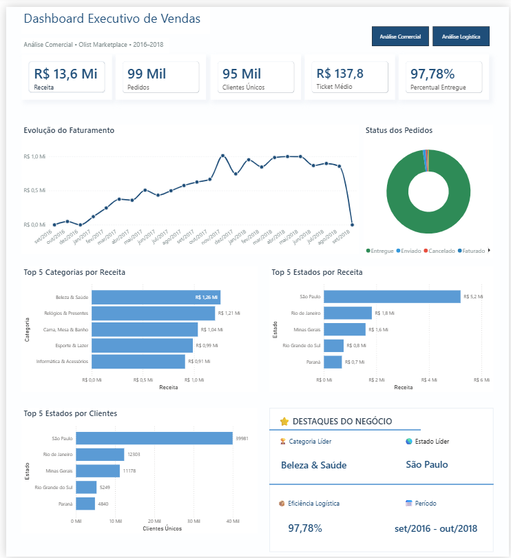
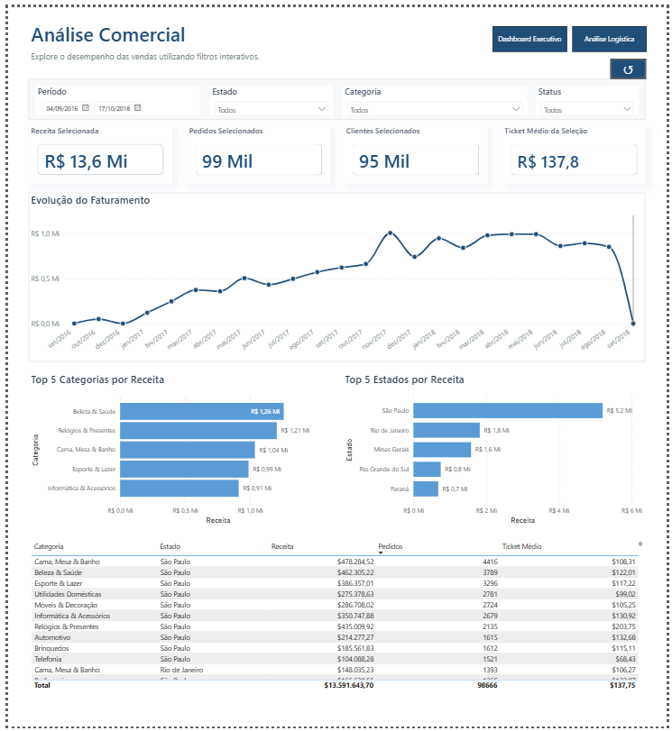
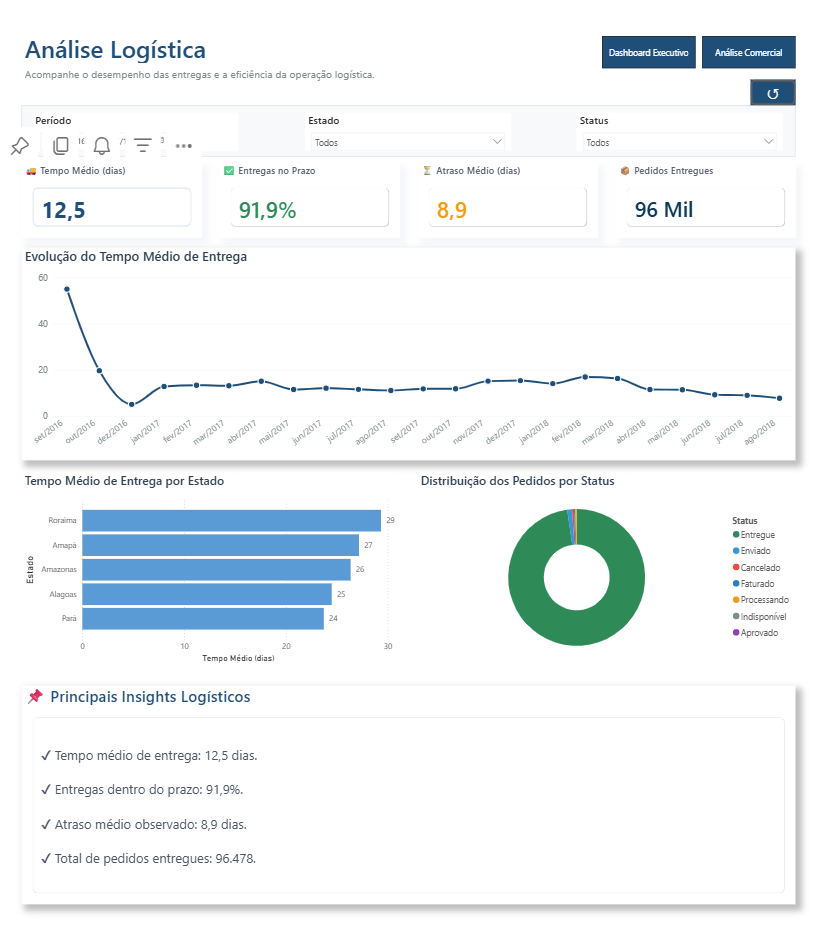
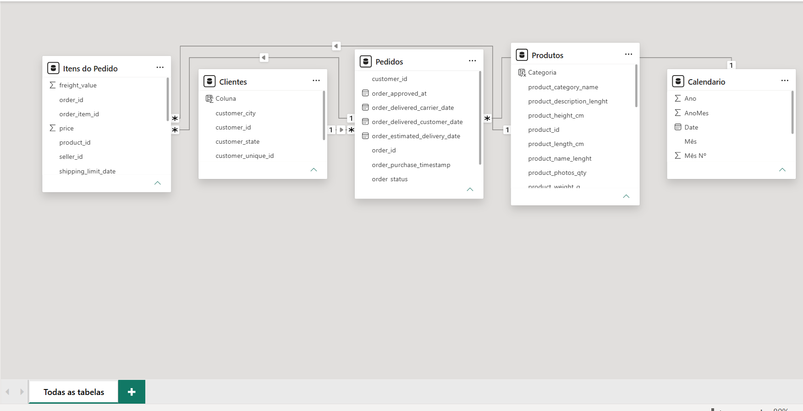

# 📊 Dashboard Executivo de Vendas | Olist E-commerce

> Dashboard desenvolvido em **Power BI** utilizando a base pública do **Olist E-commerce**, com foco na construção de uma solução de Business Intelligence para análise de desempenho comercial e logístico.

---

# 📖 Sobre o Projeto

Este projeto foi desenvolvido com o objetivo de transformar dados transacionais do marketplace Olist em informações estratégicas para apoio à tomada de decisão.

O dashboard apresenta uma visão executiva dos principais indicadores de vendas e logística, permitindo análises interativas por categoria de produto, período e localização geográfica.

Durante o desenvolvimento foram aplicados conceitos de modelagem dimensional, DAX, Storytelling com Dados, design para dashboards executivos e boas práticas de Business Intelligence.

---

# 🎯 Objetivos

* Monitorar indicadores estratégicos do marketplace.
* Avaliar o desempenho comercial.
* Acompanhar indicadores logísticos.
* Identificar categorias e estados com maior faturamento.
* Disponibilizar uma análise interativa para tomada de decisão.

---

## 🔍 Processo de Desenvolvimento

O projeto foi desenvolvido seguindo as seguintes etapas:

1. Preparação do ambiente Python
2. Análise Exploratória dos Dados (EDA)
3. Tratamento e integração dos dados
4. Planejamento da modelagem dimensional
5. Desenvolvimento do Dashboard em Power BI
6. Documentação e publicação no GitHub

### Estrutura do Projeto

- 📊 Dashboard em Power BI
- 🐍 Notebook de Análise Exploratória
- 📝 Documentação
- 💾 Exemplos de SQL

## 📌 Resumo do Projeto

| Item | Descrição |
|------|-----------|
| Ferramenta principal | Power BI |
| Linguagem de apoio | Python |
| Biblioteca | Pandas |
| Ambiente | Jupyter Notebook / VS Code |
| Modelagem | Star Schema |
| Base de dados | Olist E-commerce |
| Total de registros | ~100 mil pedidos |
| Objetivo | Construção de um Dashboard Executivo para análise comercial e logística |

# 🛠 Tecnologias Utilizadas

- Power BI Desktop
- Power Query
- DAX
- Python
- Pandas
- Jupyter Notebook
- Visual Studio Code
- GitHub
- Modelagem Dimensional (Star Schema)

---

# 📈 Indicadores Desenvolvidos

### Dashboard Executivo

* Receita Total
* Total de Pedidos
* Clientes Únicos
* Ticket Médio
* Categoria Líder
* Estado Líder

### Análise Comercial

* Receita por Categoria
* Receita por Estado
* Evolução Mensal das Vendas
* Ranking das Categorias
* Ranking dos Estados

### Análise Logística

* Pedidos Entregues
* Percentual de Entregas
* Tempo Médio de Entrega
* Atraso Médio
* Tendência das Entregas
* Painel de Insights Automáticos

---

# 🗂 Estrutura do Dashboard

O projeto está dividido em três páginas principais:

### 📌 Dashboard Executivo

Visão consolidada dos principais indicadores do negócio.

### 📈 Análise Comercial

Análise detalhada do faturamento por categoria, estado e evolução temporal.

### 🚚 Análise Logística

Indicadores relacionados ao processo de entrega, desempenho operacional e monitoramento logístico.

---

# 🧠 Modelagem de Dados

O modelo foi desenvolvido utilizando arquitetura **Star Schema**, contendo tabelas fato e dimensões relacionadas ao processo de vendas do marketplace.

Principais entidades:

* Pedidos
* Itens do Pedido
* Produtos
* Clientes
* Pagamentos
* Avaliações
* Vendedores
* Calendário

Durante o desenvolvimento foram aplicadas técnicas avançadas de contexto de filtro utilizando DAX, incluindo funções como **CALCULATE**, **CALCULATETABLE**, **VALUES**, **KEEPFILTERS** e **TREATAS** para garantir consistência dos indicadores.

---

# 📌 Principais Técnicas Aplicadas

* Modelagem Dimensional
* KPIs Dinâmicos
* Tradução da Base para Português
* Navegação entre páginas
* Botão para limpeza de filtros
* Segmentadores sincronizados
* Insights automáticos
* Contexto de Filtro Avançado
* Organização das Medidas em Pastas
* Storytelling com Dados

---

# 🚀 Como visualizar

1. Faça o download do arquivo `.pbix`.
2. Abra utilizando o **Power BI Desktop**.
3. Navegue entre as páginas utilizando os botões de navegação.
4. Utilize os filtros para explorar os indicadores.
5.
6. ## 🌐 Dashboard Online

Acesse o dashboard publicado:

🔗 [Visualizar Dashboard](https://app.powerbi.com/links/lElt3jd35q?ctid=4b4dc4f3-cb2c-4b0b-8a7c-0f345959edaa&pbi_source=linkShare)

---

# 📚 Fonte dos Dados

Base pública disponibilizada pelo Olist:

https://www.kaggle.com/datasets/olistbr/brazilian-ecommerce

---
## 💼 Competências Demonstradas

- Python
- Pandas
- ETL
- Análise Exploratória (EDA)
- Modelagem Dimensional
- Power Query
- DAX
- Storytelling com Dados
- Power BI
- GitHub
- Documentação Técnica

# 👨‍💻 Autor

**Alef Nascimento Soares Silva de Sousa**

Em transição de carreira para a área de Dados, desenvolvendo projetos voltados para Business Intelligence, Power BI, SQL e Python.

